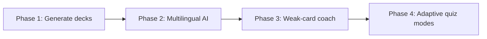

# FlashStudy AI Plan

Your app already has a solid foundation — SM-2 scheduling, multilingual cards, quality ratings, and analytics. Most competitors win on **content creation** and **personalization**, not on the algorithm itself. That's where AI can differentiate you.

---

## Where the Market Is Weak

| Competitor | Strength | Gap you can exploit |
|---|---|---|
| **Anki** | Best SRS, power users | Manual everything, ugly UX, no AI |
| **Quizlet** | Huge library, AI study modes | Shallow SRS, subscription fatigue |
| **Knowt / RemNote** | AI deck generation from notes | Weak mobile UX, generic output |
| **Duolingo / Memrise** | Language polish | Not general-purpose, not user-owned decks |

FlashStudy's angle: **serious spaced repetition + beautiful mobile UX + AI that respects your SM-2 data** — not just "generate 20 flashcards from this PDF."

---

## High-Impact AI Features (Ranked)

### 1. Generate Decks from Anything (Biggest Differentiator)

The #1 reason people churn flashcard apps is manual card entry.

- Paste notes, a URL, or upload a PDF/image
- AI extracts key concepts and generates Q/A cards
- User reviews/edits before saving (never auto-commit garbage)

**Why it wins:** Quizlet and Knowt do this, but Anki doesn't. You'd match Quizlet's ease with Anki-quality scheduling.

**Pro tier fit:** Free = 1 AI generation/month; Pro = unlimited.

**Fits your stack:** New `POST /api/topics/:id/cards/generate` endpoint, LLM on the API, store results as normal cards.

---

### 2. Smart Card Improvement (Unique to SRS Apps)

After a user creates cards manually, AI suggests improvements:

- "This answer is too long — shorten to one recallable fact"
- "Split this into 2 cards (atomic principle)"
- "Add a mnemonic for this weak card"
- "Your question is ambiguous — try: …"

Triggered from Topic Detail or when a card lands in **weak cards** 3+ times.

**Why it wins:** Nobody does this well. It ties AI directly to your analytics.

---

### 3. AI Study Coach (Session-Time Intelligence)

During quiz, when a user rates quality 0–2:

- Brief explanation of *why* they might have missed it
- Memory hook or analogy
- "Compare with card X in this deck"

Not a chatbot — a **one-tap "help me remember this"** button on missed cards.

**Why it wins:** Quizlet's Q-Chat is conversational but disconnected from SRS. Yours would be contextual to the exact card and review history.

---

### 4. Multilingual AI (Your Existing Moat)

You already have `sourceLanguage` + `language` per topic. Lean into it:

- **Auto-translate** front/back when creating cards
- **Example sentences** generated in the target language
- **Romaji/pronunciation** for Japanese (extend what `wanakana` does)
- **Reverse cards** — AI generates "answer → question" variants for bidirectional study

**Why it wins:** Generic apps treat language as an afterthought. You can be the best AI flashcard app for **Japanese, Korean, Arabic, etc.**

---

### 5. Adaptive Quiz Modes (Beyond Flip-and-Rate)

Use your quality history + AI to vary how cards are tested:

| Mode | How it works |
|---|---|
| **Cloze** | AI blanks key words from the answer |
| **Type answer** | User types; AI fuzzy-matches (handles typos, synonyms) |
| **Explain it** | User speaks/types explanation; AI scores understanding |
| **Mix-up** | AI generates plausible wrong answers as multiple choice |

SM-2 still drives *when*; AI drives *how*.

---

### 6. Weekly AI Insights (Pro Analytics++)

Replace static charts with narrative insights:

> "You struggled with verb conjugation 4 times this week. 3 cards are due tomorrow — want a focused 5-minute session?"

Generated from your existing `weakCards`, `qualityDistribution`, and `forecast` data — AI just writes the summary and recommendation.

**Cheap to build, high perceived value.**

---

### 7. Import & Clean Shared Decks

Users paste Anki/Quizlet exports or messy bullet lists. AI:

- Deduplicates near-identical cards
- Normalizes formatting
- Tags by subtopic
- Flags low-quality cards

---

## What to Avoid

- **Generic AI chat tab** — feels bolted-on, expensive, rarely used
- **Auto-generating without review** — users lose trust when cards are wrong
- **Replacing SM-2 with "AI scheduling"** — your algorithm is a feature, not a bug; market it as "AI-enhanced SM-2" not "AI replaces SM-2"
- **Shipping everything at once** — pick 1–2, nail them, charge for them

---

## Suggested Roadmap



| Phase | Feature | Effort | Revenue impact |
|---|---|---|---|
| **1** | Generate deck from text/PDF | Medium | High — drives signups |
| **2** | Translate + example sentences | Low–medium | High for language learners |
| **3** | "Help me remember" on weak cards | Medium | Strong Pro retention |
| **4** | Cloze / type-answer modes | High | Power-user lock-in |

---

## Technical Approach (Fits Your Codebase)

```
mobile → POST /api/ai/generate-cards { topicId, source: text|url, prompt? }
api    → rate limit by tier → call OpenAI/Anthropic → validate JSON schema
       → return draft cards → user approves → bulk POST to /cards
```

- **API keys server-side only** (`OPENAI_API_KEY` in `api/.env`)
- **Rate limits:** free = 5 generations/month, Pro = unlimited
- **Cache** common generations to cut costs
- **Structured output** (JSON schema) so cards always match your `Card` model
- **Pro gate** in `topicController`-style middleware

---

## Positioning One-Liner

> **"FlashStudy: spaced repetition that thinks — AI builds your decks, coaches your weak spots, and speaks your language."**

That separates you from Anki (manual), Quizlet (shallow), and Knowt (generate-only).

---

## Next Steps

If you want to build this, **Phase 1 (generate decks from pasted text)** is the best starting point — it's the most market-visible, maps cleanly to your existing card/topic models, and gives Pro a clear upgrade reason beyond deck limits.

---

*Last updated: June 2026*
